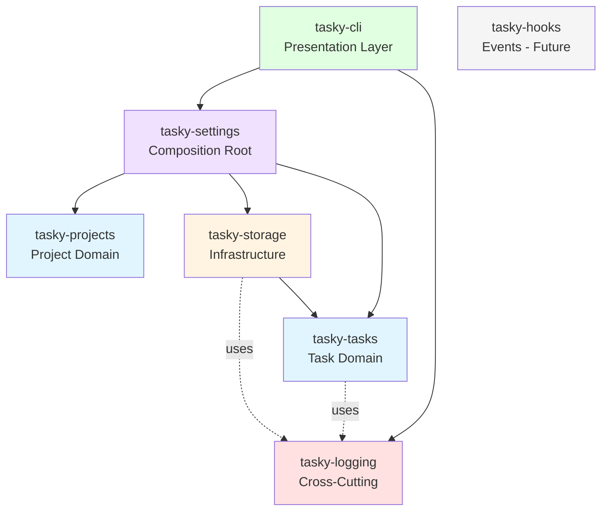
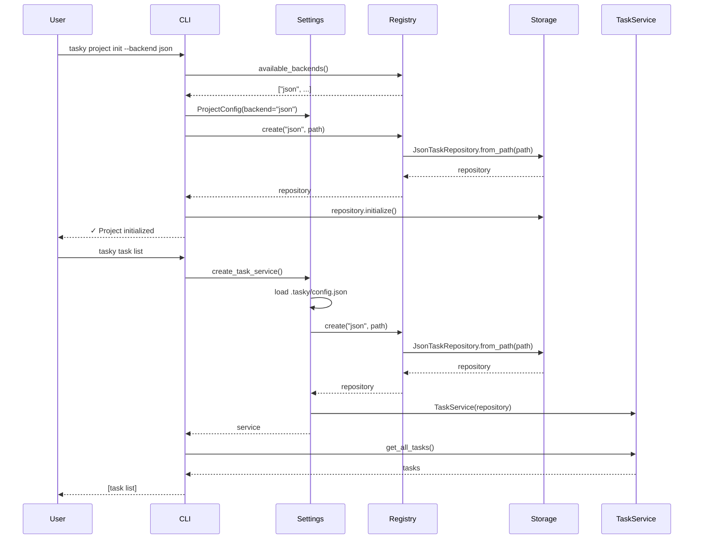
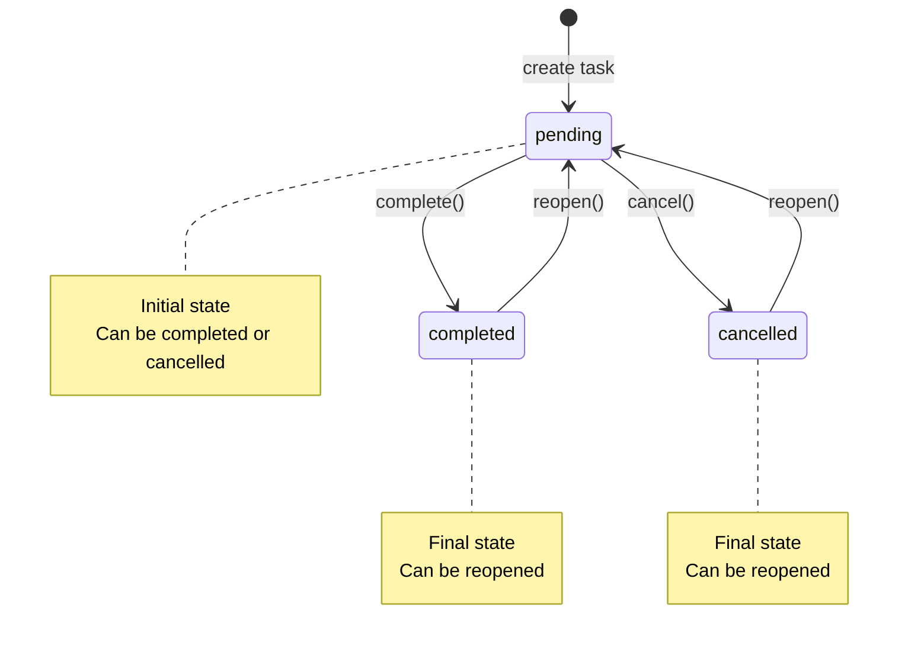
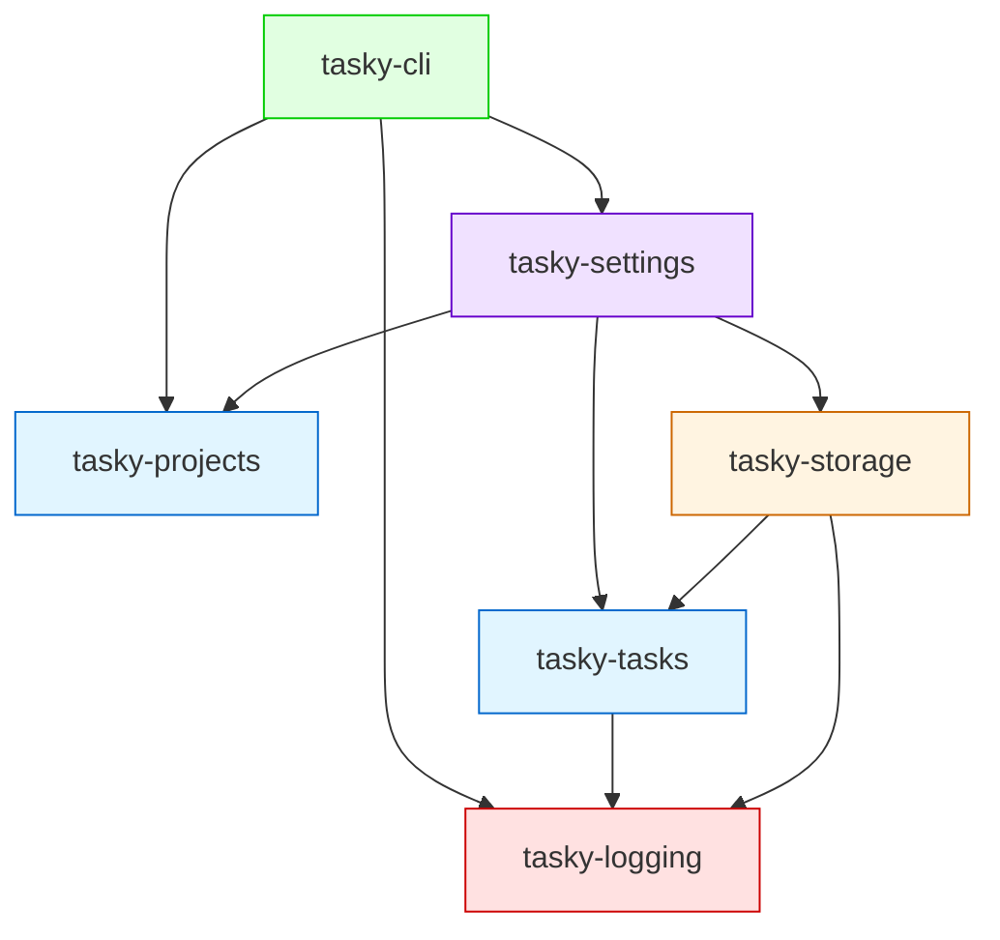

# Tasky Vision & Architecture Specification

**Version**: 1.0  
**Date**: November 11, 2025  
**Status**: Approved Specification

---

## Table of Contents

1. [Architecture Overview](#architecture-overview)
2. [User Story 1: Automatic Timestamp Management](#user-story-1-automatic-timestamp-management)
3. [User Story 2: Configurable Storage Backends](#user-story-2-configurable-storage-backends)
4. [User Story 3: Domain Exception Hierarchy](#user-story-3-domain-exception-hierarchy)
5. [User Story 4: Task State Transition Validation](#user-story-4-task-state-transition-validation)
6. [User Story 5: Pluggable Logging System](#user-story-5-pluggable-logging-system)
7. [User Story 6: Task Filtering and Querying](#user-story-6-task-filtering-and-querying)
8. [Package Structure](#package-structure)
9. [Implementation Phases](#implementation-phases)

---

## Architecture Overview

Tasky follows **Domain-Driven Design** with **Clean Architecture** principles:



**Key Principles**:
- Domain packages (`tasky-tasks`, `tasky-projects`) have NO infrastructure dependencies
- Infrastructure (`tasky-storage`) implements domain ports
- Settings package acts as composition root, wiring everything together
- CLI depends only on settings and logging

---

## User Story 1: Automatic Timestamp Management

**As a** task manager user  
**I want** task timestamps to automatically update when modified  
**So that** I can track when tasks were last changed

### Acceptance Criteria

1. `TaskModel.created_at` is set to UTC timestamp when task is created
2. `TaskModel.updated_at` is set to UTC timestamp when task is created
3. `TaskModel.updated_at` is updated to current UTC time when task is modified
4. Timestamp updates are explicit and visible in code (no magic validators)

### Technical Specification

#### Model Changes

```python
# packages/tasky-tasks/src/tasky_tasks/models.py
from datetime import UTC, datetime
from enum import Enum
from uuid import UUID, uuid4

from pydantic import BaseModel, ConfigDict, Field


class TaskStatus(str, Enum):
    """Task status enumeration."""
    pending = "pending"
    completed = "completed"
    cancelled = "cancelled"


class TaskModel(BaseModel):
    """A model representing a task in the task management system."""

    model_config = ConfigDict(
        validate_assignment=True,
        extra="forbid",
    )

    task_id: UUID = Field(
        default_factory=uuid4,
        description="The ID of the task.",
    )
    name: str = Field(
        ...,
        description="The name of the task.",
    )
    details: str = Field(
        ...,
        description="The details of the task.",
    )
    status: TaskStatus = Field(
        default=TaskStatus.pending,
        description="The status of the task.",
    )
    created_at: datetime = Field(
        default_factory=lambda: datetime.now(tz=UTC),
        description="The date and time the task was created.",
    )
    updated_at: datetime = Field(
        default_factory=lambda: datetime.now(tz=UTC),
        description="The date and time the task was last updated.",
    )

    def mark_updated(self) -> None:
        """Update the updated_at timestamp to current UTC time."""
        self.updated_at = datetime.now(tz=UTC)
```

#### Service Changes

```python
# packages/tasky-tasks/src/tasky_tasks/service.py
class TaskService:
    """Service for managing tasks."""

    def __init__(self, repository: TaskRepository) -> None:
        self.repository = repository

    def create_task(self, name: str, details: str) -> TaskModel:
        """Create a new task."""
        task = TaskModel(name=name, details=details)
        self.repository.save_task(task)
        return task

    def update_task(self, task: TaskModel) -> None:
        """Update an existing task."""
        task.mark_updated()  # ← Explicit timestamp update
        self.repository.save_task(task)

    # ... other methods unchanged
```

#### Test Requirements

```python
# packages/tasky-tasks/tests/test_models.py
def test_mark_updated_changes_timestamp():
    """Verify mark_updated() updates the timestamp."""
    task = TaskModel(name="Test", details="Details")
    original_time = task.updated_at
    
    time.sleep(0.01)  # Ensure time passes
    task.mark_updated()
    
    assert task.updated_at > original_time

def test_created_and_updated_use_utc():
    """Verify timestamps are timezone-aware and use UTC."""
    task = TaskModel(name="Test", details="Details")
    
    assert task.created_at.tzinfo is not None
    assert task.created_at.tzinfo == UTC
    assert task.updated_at.tzinfo is not None
    assert task.updated_at.tzinfo == UTC
```

---

## User Story 2: Configurable Storage Backends

**As a** developer or power user  
**I want** to choose different storage backends for my tasks  
**So that** I can use JSON for simple projects, SQLite for larger ones, or Postgres for production

### Acceptance Criteria

1. Project configuration is stored in `.tasky/config.json`
2. Users can specify backend during `tasky project init --backend <name>`
3. CLI commands read config and use appropriate backend automatically
4. Adding new backends requires zero CLI code changes
5. Default backend is JSON if not specified

### Technical Specification

#### Project Configuration Schema

```json
{
  "version": "1.0",
  "storage": {
    "backend": "json",
    "path": "tasks.json"
  },
  "created_at": "2025-11-11T10:00:00Z"
}
```

**Location**: `.tasky/config.json` (relative to project root)

#### Package: tasky-projects

**Purpose**: Define project-level domain models

```python
# packages/tasky-projects/src/tasky_projects/config.py
from datetime import UTC, datetime
from pathlib import Path
from typing import Any

from pydantic import BaseModel, Field


class StorageConfig(BaseModel):
    """Storage backend configuration."""
    backend: str = Field(
        default="json",
        description="Storage backend name (json, sqlite, postgres, etc.)",
    )
    path: str = Field(
        default="tasks.json",
        description="Storage file path relative to .tasky/",
    )


class ProjectConfig(BaseModel):
    """Project configuration model."""
    version: str = Field(
        default="1.0",
        description="Configuration version for future migrations",
    )
    storage: StorageConfig = Field(
        default_factory=StorageConfig,
        description="Storage backend configuration",
    )
    created_at: datetime = Field(
        default_factory=lambda: datetime.now(tz=UTC),
        description="When this project was initialized",
    )

    @classmethod
    def from_file(cls, path: Path) -> "ProjectConfig":
        """Load configuration from JSON file."""
        import json
        content = path.read_text(encoding="utf-8")
        data = json.loads(content)
        return cls.model_validate(data)

    def to_file(self, path: Path) -> None:
        """Save configuration to JSON file."""
        path.parent.mkdir(parents=True, exist_ok=True)
        path.write_text(self.model_dump_json(indent=2), encoding="utf-8")
```

**Export**:
```python
# packages/tasky-projects/src/tasky_projects/__init__.py
from .config import ProjectConfig, StorageConfig

__all__ = ["ProjectConfig", "StorageConfig"]
```

#### Package: tasky-settings

**Purpose**: Backend registry and service factory (composition root)

```python
# packages/tasky-settings/src/tasky_settings/backend_registry.py
from pathlib import Path
from typing import Callable

from tasky_tasks.ports import TaskRepository

BackendFactory = Callable[[Path], TaskRepository]


class BackendRegistry:
    """Registry for storage backend factories."""

    def __init__(self) -> None:
        self._backends: dict[str, BackendFactory] = {}

    def register(self, name: str, factory: BackendFactory) -> None:
        """Register a backend factory.
        
        Args:
            name: Backend identifier (e.g., "json", "sqlite")
            factory: Factory function that takes a Path and returns TaskRepository
        """
        self._backends[name] = factory

    def create(self, name: str, path: Path) -> TaskRepository:
        """Create a repository instance for the given backend.
        
        Args:
            name: Backend identifier
            path: Storage path
            
        Returns:
            TaskRepository instance
            
        Raises:
            ValueError: If backend is not registered
        """
        if name not in self._backends:
            available = ", ".join(self.available_backends())
            raise ValueError(
                f"Unknown backend: {name}. Available backends: {available}"
            )
        return self._backends[name](path)

    def available_backends(self) -> list[str]:
        """Return list of registered backend names."""
        return list(self._backends.keys())


# Global singleton registry
registry = BackendRegistry()
```

```python
# packages/tasky-settings/src/tasky_settings/factory.py
from pathlib import Path

from tasky_projects import ProjectConfig
from tasky_settings.backend_registry import registry
from tasky_tasks.service import TaskService


class ProjectNotFoundError(Exception):
    """Raised when no project configuration is found."""
    pass


def create_task_service(project_root: Path | None = None) -> TaskService:
    """Create a TaskService from project configuration.
    
    Args:
        project_root: Project root directory (defaults to current working directory)
        
    Returns:
        Configured TaskService instance
        
    Raises:
        ProjectNotFoundError: If no .tasky/config.json found
        ValueError: If configured backend is not registered
    """
    if project_root is None:
        project_root = Path.cwd()

    config_path = project_root / ".tasky" / "config.json"
    
    if not config_path.exists():
        raise ProjectNotFoundError(
            "No project found. Run 'tasky project init' first."
        )
    
    config = ProjectConfig.from_file(config_path)
    storage_path = project_root / ".tasky" / config.storage.path
    
    repository = registry.create(config.storage.backend, storage_path)
    return TaskService(repository=repository)
```

**Export**:
```python
# packages/tasky-settings/src/tasky_settings/__init__.py
from .backend_registry import BackendFactory, BackendRegistry, registry
from .factory import ProjectNotFoundError, create_task_service

__all__ = [
    "BackendFactory",
    "BackendRegistry",
    "registry",
    "create_task_service",
    "ProjectNotFoundError",
]
```

#### Backend Registration

Storage backends register themselves at module load:

```python
# packages/tasky-storage/src/tasky_storage/__init__.py
from .backends.json import JsonStorage, JsonTaskRepository, TaskDocument
from .errors import StorageConfigurationError, StorageDataError, StorageError

# Register backends with the global registry
try:
    from tasky_settings import registry
    registry.register("json", JsonTaskRepository.from_path)
except ImportError:
    # tasky-settings not available (e.g., during testing)
    pass

__all__ = [
    "JsonStorage",
    "JsonTaskRepository",
    "StorageConfigurationError",
    "StorageDataError",
    "StorageError",
    "TaskDocument",
]
```

**Future backends** (e.g., SQLite):
```python
# packages/tasky-storage/src/tasky_storage/backends/sqlite/__init__.py
from tasky_settings import registry
registry.register("sqlite", SqliteTaskRepository.from_path)
```

#### CLI Integration

**Project Init Command**:
```python
# packages/tasky-cli/src/tasky_cli/commands/projects.py
from pathlib import Path

import typer
from tasky_projects import ProjectConfig, StorageConfig
from tasky_settings import registry

project_app = typer.Typer(no_args_is_help=True)


@project_app.command(name="init")
def init_command(
    backend: str = typer.Option(
        "json",
        "--backend",
        "-b",
        help="Storage backend to use",
    ),
) -> None:
    """Initialize a new Tasky project."""
    # Validate backend exists
    available_backends = registry.available_backends()
    if backend not in available_backends:
        available = ", ".join(available_backends)
        typer.secho(
            f"Error: Unknown backend '{backend}'. Available: {available}",
            fg=typer.colors.RED,
            err=True,
        )
        raise typer.Exit(1)
    
    storage_root = Path(".tasky")
    
    # Check if already initialized
    config_path = storage_root / "config.json"
    if config_path.exists():
        typer.secho(
            "Error: Project already initialized",
            fg=typer.colors.RED,
            err=True,
        )
        raise typer.Exit(1)
    
    # Create config
    storage_root.mkdir(parents=True, exist_ok=True)
    config = ProjectConfig(
        storage=StorageConfig(backend=backend, path="tasks.json")
    )
    config.to_file(config_path)
    
    # Initialize storage using the factory
    storage_path = storage_root / config.storage.path
    repository = registry.create(backend, storage_path)
    repository.initialize()
    
    typer.secho(
        f"✓ Project initialized with {backend} backend",
        fg=typer.colors.GREEN,
    )
    typer.echo(f"  Config: {config_path}")
    typer.echo(f"  Storage: {storage_path}")


@project_app.command(name="info")
def info_command() -> None:
    """Show project configuration."""
    config_path = Path(".tasky/config.json")
    
    if not config_path.exists():
        typer.secho(
            "Error: No project found. Run 'tasky project init' first.",
            fg=typer.colors.RED,
            err=True,
        )
        raise typer.Exit(1)
    
    config = ProjectConfig.from_file(config_path)
    
    typer.echo("Project Configuration:")
    typer.echo(f"  Backend: {config.storage.backend}")
    typer.echo(f"  Storage: .tasky/{config.storage.path}")
    typer.echo(f"  Created: {config.created_at}")
```

**Task Commands**:
```python
# packages/tasky-cli/src/tasky_cli/commands/tasks.py
import typer
from tasky_settings import ProjectNotFoundError, create_task_service

task_app = typer.Typer(no_args_is_help=True)


@task_app.command(name="list")
def list_command() -> None:
    """List all tasks."""
    try:
        service = create_task_service()
        tasks = service.get_all_tasks()
        
        if not tasks:
            typer.echo("No tasks found.")
            return
        
        for task in tasks:
            status_icon = "✓" if task.status.value == "completed" else "○"
            typer.echo(f"{status_icon} {task.name} - {task.details}")
    
    except ProjectNotFoundError as e:
        typer.secho(f"Error: {e}", fg=typer.colors.RED, err=True)
        raise typer.Exit(1)
    except ValueError as e:  # Unknown backend
        typer.secho(f"Error: {e}", fg=typer.colors.RED, err=True)
        raise typer.Exit(1)


@task_app.command(name="create")
def create_command(
    name: str = typer.Argument(..., help="Task name"),
    details: str = typer.Argument(..., help="Task details"),
) -> None:
    """Create a new task."""
    try:
        service = create_task_service()
        task = service.create_task(name=name, details=details)
        typer.secho(
            f"✓ Task created: {task.name} (ID: {task.task_id})",
            fg=typer.colors.GREEN,
        )
    
    except ProjectNotFoundError as e:
        typer.secho(f"Error: {e}", fg=typer.colors.RED, err=True)
        raise typer.Exit(1)
```

#### Sequence Diagram: Backend Selection



#### Dependencies

```toml
# packages/tasky-projects/pyproject.toml
[project]
name = "tasky-projects"
requires-python = ">=3.13"
dependencies = ["pydantic>=2.0.0"]

# packages/tasky-settings/pyproject.toml
[project]
name = "tasky-settings"
requires-python = ">=3.13"
dependencies = [
    "tasky-tasks",
    "tasky-projects",
]

# packages/tasky-cli/pyproject.toml
[project]
name = "tasky-cli"
requires-python = ">=3.13"
dependencies = [
    "typer>=0.20.0",
    "rich>=13.8.0",
    "tasky-settings",
    "tasky-projects",  # For type hints
]
```

---

## User Story 3: Domain Exception Hierarchy

**As a** developer  
**I want** specific exception types for different failure scenarios  
**So that** I can handle errors appropriately and provide clear user feedback

### Acceptance Criteria

1. Domain exceptions are separate from storage exceptions
2. Exceptions include contextual information (task_id, status, etc.)
3. CLI can distinguish between "not found" vs "validation" vs "state transition" errors
4. Error messages are user-friendly and actionable

### Technical Specification

#### Exception Hierarchy

```python
# packages/tasky-tasks/src/tasky_tasks/exceptions.py
from uuid import UUID

from tasky_tasks.models import TaskStatus


class TaskDomainError(Exception):
    """Base exception for task domain violations."""
    pass


class TaskNotFoundError(TaskDomainError):
    """Raised when a task cannot be found."""
    
    def __init__(self, task_id: UUID) -> None:
        self.task_id = task_id
        super().__init__(f"Task not found: {task_id}")


class TaskValidationError(TaskDomainError):
    """Raised when task data fails validation."""
    pass


class InvalidStateTransitionError(TaskDomainError):
    """Raised when attempting an invalid status transition."""
    
    def __init__(self, current: TaskStatus, attempted: TaskStatus) -> None:
        self.current_status = current
        self.attempted_status = attempted
        super().__init__(
            f"Cannot transition from {current.value} to {attempted.value}"
        )
```

**Export**:
```python
# packages/tasky-tasks/src/tasky_tasks/__init__.py
from .exceptions import (
    InvalidStateTransitionError,
    TaskDomainError,
    TaskNotFoundError,
    TaskValidationError,
)
from .models import TaskModel, TaskStatus
from .ports import TaskRepository
from .service import TaskService

__all__ = [
    "InvalidStateTransitionError",
    "TaskDomainError",
    "TaskModel",
    "TaskNotFoundError",
    "TaskRepository",
    "TaskService",
    "TaskStatus",
    "TaskValidationError",
]
```

#### Service Layer Integration

```python
# packages/tasky-tasks/src/tasky_tasks/service.py
from uuid import UUID

from tasky_tasks.exceptions import TaskNotFoundError
from tasky_tasks.models import TaskModel
from tasky_tasks.ports import TaskRepository


class TaskService:
    """Service for managing tasks."""

    def __init__(self, repository: TaskRepository) -> None:
        self.repository = repository

    def get_task(self, task_id: UUID) -> TaskModel:
        """Get a task by ID.
        
        Raises:
            TaskNotFoundError: If task does not exist
        """
        task = self.repository.get_task(task_id)
        if task is None:
            raise TaskNotFoundError(task_id)
        return task

    def delete_task(self, task_id: UUID) -> None:
        """Delete a task by ID.
        
        Raises:
            TaskNotFoundError: If task does not exist
        """
        deleted = self.repository.delete_task(task_id)
        if not deleted:
            raise TaskNotFoundError(task_id)
    
    # Future methods will raise InvalidStateTransitionError
    # when state machine is implemented
```

#### CLI Error Handling

```python
# packages/tasky-cli/src/tasky_cli/commands/tasks.py
from uuid import UUID

import typer
from tasky_settings import ProjectNotFoundError, create_task_service
from tasky_tasks import InvalidStateTransitionError, TaskNotFoundError


@task_app.command(name="delete")
def delete_command(
    task_id: str = typer.Argument(..., help="Task ID to delete"),
) -> None:
    """Delete a task."""
    try:
        service = create_task_service()
        uuid = UUID(task_id)
        service.delete_task(uuid)
        typer.secho(f"✓ Task {task_id} deleted", fg=typer.colors.GREEN)
    
    except ValueError:
        typer.secho(
            f"Error: Invalid task ID format: {task_id}",
            fg=typer.colors.RED,
            err=True,
        )
        raise typer.Exit(1)
    
    except TaskNotFoundError as e:
        typer.secho(
            f"Error: Task not found: {e.task_id}",
            fg=typer.colors.RED,
            err=True,
        )
        raise typer.Exit(1)
    
    except ProjectNotFoundError as e:
        typer.secho(f"Error: {e}", fg=typer.colors.RED, err=True)
        raise typer.Exit(1)
```

#### Error Propagation Rules

1. **Repository Layer**: Raises `StorageDataError` for I/O or serialization failures
2. **Service Layer**: 
   - Catches `StorageDataError`, may re-raise or wrap as domain error
   - Raises domain exceptions (`TaskNotFoundError`, etc.) for business rule violations
3. **CLI Layer**: Catches all exceptions, formats user-friendly messages, exits with appropriate codes

---

## User Story 4: Task State Transition Validation

**As a** task manager  
**I want** tasks to only transition between valid states  
**So that** data integrity is maintained and workflows are enforced

### Acceptance Criteria

1. Tasks can only transition: `pending → completed`, `pending → cancelled`
2. Completed/cancelled tasks can be reopened to `pending`
3. Invalid transitions raise `InvalidStateTransitionError`
4. Service provides explicit methods: `complete_task()`, `cancel_task()`, `reopen_task()`
5. Direct status assignment is prevented after transitions are implemented

### Technical Specification

#### State Machine Definition

```python
# packages/tasky-tasks/src/tasky_tasks/models.py
from datetime import UTC, datetime
from enum import Enum
from uuid import UUID, uuid4

from pydantic import BaseModel, ConfigDict, Field

from tasky_tasks.exceptions import InvalidStateTransitionError


class TaskStatus(str, Enum):
    """Task status enumeration."""
    pending = "pending"
    completed = "completed"
    cancelled = "cancelled"
    
    def can_transition_to(self, target: "TaskStatus") -> bool:
        """Check if transition to target status is allowed."""
        allowed = TASK_TRANSITIONS.get(self, set())
        return target in allowed


# State transition rules
TASK_TRANSITIONS: dict[TaskStatus, set[TaskStatus]] = {
    TaskStatus.pending: {TaskStatus.completed, TaskStatus.cancelled},
    TaskStatus.completed: {TaskStatus.pending},  # reopen
    TaskStatus.cancelled: {TaskStatus.pending},  # reopen
}


class TaskModel(BaseModel):
    """A model representing a task in the task management system."""

    model_config = ConfigDict(
        validate_assignment=True,
        extra="forbid",
    )

    task_id: UUID = Field(default_factory=uuid4)
    name: str = Field(...)
    details: str = Field(...)
    status: TaskStatus = Field(default=TaskStatus.pending)
    created_at: datetime = Field(default_factory=lambda: datetime.now(tz=UTC))
    updated_at: datetime = Field(default_factory=lambda: datetime.now(tz=UTC))

    def mark_updated(self) -> None:
        """Update the updated_at timestamp to current UTC time."""
        self.updated_at = datetime.now(tz=UTC)

    def complete(self) -> None:
        """Mark task as completed.
        
        Raises:
            InvalidStateTransitionError: If not in pending status
        """
        if not self.status.can_transition_to(TaskStatus.completed):
            raise InvalidStateTransitionError(self.status, TaskStatus.completed)
        self.status = TaskStatus.completed
        self.mark_updated()

    def cancel(self) -> None:
        """Mark task as cancelled.
        
        Raises:
            InvalidStateTransitionError: If not in pending status
        """
        if not self.status.can_transition_to(TaskStatus.cancelled):
            raise InvalidStateTransitionError(self.status, TaskStatus.cancelled)
        self.status = TaskStatus.cancelled
        self.mark_updated()

    def reopen(self) -> None:
        """Reopen a completed or cancelled task.
        
        Raises:
            InvalidStateTransitionError: If already pending
        """
        if not self.status.can_transition_to(TaskStatus.pending):
            raise InvalidStateTransitionError(self.status, TaskStatus.pending)
        self.status = TaskStatus.pending
        self.mark_updated()
```

#### Service Layer Methods

```python
# packages/tasky-tasks/src/tasky_tasks/service.py
from uuid import UUID

from tasky_tasks.exceptions import TaskNotFoundError
from tasky_tasks.models import TaskModel
from tasky_tasks.ports import TaskRepository


class TaskService:
    """Service for managing tasks."""

    def __init__(self, repository: TaskRepository) -> None:
        self.repository = repository

    def complete_task(self, task_id: UUID) -> TaskModel:
        """Mark a task as completed.
        
        Args:
            task_id: UUID of the task to complete
            
        Returns:
            Updated task model
            
        Raises:
            TaskNotFoundError: If task does not exist
            InvalidStateTransitionError: If task cannot be completed
        """
        task = self.get_task(task_id)
        task.complete()
        self.repository.save_task(task)
        return task

    def cancel_task(self, task_id: UUID) -> TaskModel:
        """Mark a task as cancelled.
        
        Args:
            task_id: UUID of the task to cancel
            
        Returns:
            Updated task model
            
        Raises:
            TaskNotFoundError: If task does not exist
            InvalidStateTransitionError: If task cannot be cancelled
        """
        task = self.get_task(task_id)
        task.cancel()
        self.repository.save_task(task)
        return task

    def reopen_task(self, task_id: UUID) -> TaskModel:
        """Reopen a completed or cancelled task.
        
        Args:
            task_id: UUID of the task to reopen
            
        Returns:
            Updated task model
            
        Raises:
            TaskNotFoundError: If task does not exist
            InvalidStateTransitionError: If task cannot be reopened
        """
        task = self.get_task(task_id)
        task.reopen()
        self.repository.save_task(task)
        return task

    # ... other methods
```

#### CLI Commands

```python
# packages/tasky-cli/src/tasky_cli/commands/tasks.py

@task_app.command(name="complete")
def complete_command(
    task_id: str = typer.Argument(..., help="Task ID to complete"),
) -> None:
    """Mark a task as completed."""
    try:
        service = create_task_service()
        uuid = UUID(task_id)
        task = service.complete_task(uuid)
        typer.secho(
            f"✓ Task completed: {task.name}",
            fg=typer.colors.GREEN,
        )
    
    except ValueError:
        typer.secho(
            f"Error: Invalid task ID format: {task_id}",
            fg=typer.colors.RED,
            err=True,
        )
        raise typer.Exit(1)
    
    except TaskNotFoundError as e:
        typer.secho(
            f"Error: Task not found: {e.task_id}",
            fg=typer.colors.RED,
            err=True,
        )
        raise typer.Exit(1)
    
    except InvalidStateTransitionError as e:
        typer.secho(
            f"Error: {e}",
            fg=typer.colors.RED,
            err=True,
        )
        raise typer.Exit(1)
    
    except ProjectNotFoundError as e:
        typer.secho(f"Error: {e}", fg=typer.colors.RED, err=True)
        raise typer.Exit(1)


@task_app.command(name="cancel")
def cancel_command(
    task_id: str = typer.Argument(..., help="Task ID to cancel"),
) -> None:
    """Mark a task as cancelled."""
    # Similar to complete_command, calls service.cancel_task()
    pass


@task_app.command(name="reopen")
def reopen_command(
    task_id: str = typer.Argument(..., help="Task ID to reopen"),
) -> None:
    """Reopen a completed or cancelled task."""
    # Similar to complete_command, calls service.reopen_task()
    pass
```

#### State Transition Diagram



---

## User Story 5: Pluggable Logging System

**As a** developer or user  
**I want** to see application logs when debugging  
**So that** I can understand what the application is doing and troubleshoot issues

### Acceptance Criteria

1. Logging is abstracted in a separate `tasky-logging` package
2. Default implementation uses Python's stdlib `logging`
3. Logging library can be swapped (e.g., to loguru) without changing other packages
4. CLI supports `--verbose` flag to increase log level
5. Logs include context (operation, task IDs, etc.)

### Technical Specification

#### Package: tasky-logging

```python
# packages/tasky-logging/src/tasky_logging/__init__.py
"""Logging infrastructure for Tasky.

This package provides a logging abstraction that can be swapped
without modifying other packages.
"""

import logging
from typing import Any, Protocol


class Logger(Protocol):
    """Logger protocol for dependency injection."""
    
    def debug(self, msg: str, **kwargs: Any) -> None:
        """Log debug message."""
        ...
    
    def info(self, msg: str, **kwargs: Any) -> None:
        """Log info message."""
        ...
    
    def warning(self, msg: str, **kwargs: Any) -> None:
        """Log warning message."""
        ...
    
    def error(self, msg: str, **kwargs: Any) -> None:
        """Log error message."""
        ...


def get_logger(name: str) -> logging.Logger:
    """Get a logger instance.
    
    Returns a standard library logger under the 'tasky' namespace.
    In the future, this can be swapped to return loguru, structlog,
    or custom implementations.
    
    Args:
        name: Logger name (typically __name__ of the calling module)
        
    Returns:
        Logger instance
    """
    return logging.getLogger(f"tasky.{name}")


__all__ = ["Logger", "get_logger"]
```

```python
# packages/tasky-logging/src/tasky_logging/config.py
"""Logging configuration."""

import logging
import sys


def configure_logging(
    verbosity: int = 0,
    format_style: str = "standard",
) -> None:
    """Configure the logging system.
    
    Args:
        verbosity: 0=WARNING, 1=INFO, 2+=DEBUG
        format_style: Output format ("standard", "json", "colored")
    """
    level_map = {
        0: logging.WARNING,
        1: logging.INFO,
    }
    level = level_map.get(verbosity, logging.DEBUG)
    
    # Configure root tasky logger
    logger = logging.getLogger("tasky")
    logger.setLevel(level)
    
    # Remove existing handlers to avoid duplicates
    logger.handlers.clear()
    
    # Add stderr handler
    handler = logging.StreamHandler(sys.stderr)
    handler.setLevel(level)
    
    # Choose formatter based on format_style
    if format_style == "json":
        formatter = logging.Formatter(
            '{"time":"%(asctime)s","name":"%(name)s",'
            '"level":"%(levelname)s","msg":"%(message)s"}'
        )
    else:
        formatter = logging.Formatter(
            "%(asctime)s - %(name)s - %(levelname)s - %(message)s"
        )
    
    handler.setFormatter(formatter)
    logger.addHandler(handler)
    
    # Prevent propagation to root logger
    logger.propagate = False


__all__ = ["configure_logging"]
```

**Export**:
```python
# packages/tasky-logging/src/tasky_logging/__init__.py (updated)
from .config import configure_logging

__all__ = ["Logger", "get_logger", "configure_logging"]
```

**Dependencies**:
```toml
# packages/tasky-logging/pyproject.toml
[project]
name = "tasky-logging"
version = "0.1.0"
requires-python = ">=3.13"
dependencies = []  # No dependencies, uses stdlib only
```

#### Usage in Domain Packages

```python
# packages/tasky-tasks/src/tasky_tasks/service.py
from uuid import UUID

from tasky_logging import get_logger
from tasky_tasks.exceptions import TaskNotFoundError
from tasky_tasks.models import TaskModel
from tasky_tasks.ports import TaskRepository

logger = get_logger(__name__)


class TaskService:
    """Service for managing tasks."""

    def __init__(self, repository: TaskRepository) -> None:
        self.repository = repository

    def create_task(self, name: str, details: str) -> TaskModel:
        """Create a new task."""
        logger.info(f"Creating task: {name}")
        task = TaskModel(name=name, details=details)
        self.repository.save_task(task)
        logger.debug(f"Task created with ID: {task.task_id}")
        return task

    def complete_task(self, task_id: UUID) -> TaskModel:
        """Mark a task as completed."""
        logger.info(f"Completing task: {task_id}")
        task = self.get_task(task_id)
        task.complete()
        self.repository.save_task(task)
        logger.debug(f"Task {task_id} marked as completed")
        return task
    
    # ... other methods with logging
```

```python
# packages/tasky-storage/src/tasky_storage/backends/json/repository.py
from tasky_logging import get_logger

logger = get_logger(__name__)


class JsonTaskRepository(BaseModel):
    """JSON-based task repository implementation."""

    storage: JsonStorage

    def save_task(self, task: TaskModel) -> None:
        """Persist a task snapshot to storage."""
        logger.debug(f"Saving task {task.task_id} to storage")
        # ... existing implementation
        logger.debug(f"Task {task.task_id} saved successfully")
    
    # ... other methods with logging
```

#### CLI Integration

```python
# packages/tasky-cli/src/tasky_cli/__init__.py
from __future__ import annotations

import typer
from tasky_logging import configure_logging

from .commands import project_app, task_app

app = typer.Typer(no_args_is_help=True, add_completion=False)

app.add_typer(project_app, name="project")
app.add_typer(task_app, name="task")


@app.callback()
def main_callback(
    verbose: int = typer.Option(
        0,
        "--verbose",
        "-v",
        count=True,
        help="Increase verbosity (can be repeated: -v, -vv)",
    ),
) -> None:
    """Tasky - Task management with LLMs in mind."""
    configure_logging(verbosity=verbose)


def main() -> None:
    """Run the Tasky CLI application."""
    app()


if __name__ == "__main__":
    main()
```

**Usage Examples**:
```bash
# No logs (WARNING level only)
tasky task list

# Show INFO logs
tasky -v task list

# Show DEBUG logs
tasky -vv task list
```

#### Future: Swapping to Loguru

When switching to loguru, only `tasky-logging` needs to change:

```python
# packages/tasky-logging/src/tasky_logging/__init__.py (future)
from loguru import logger as _loguru_logger


def get_logger(name: str):
    """Get a loguru logger instance."""
    return _loguru_logger.bind(component=name)


# packages/tasky-logging/src/tasky_logging/config.py (future)
from loguru import logger


def configure_logging(verbosity: int = 0, format_style: str = "standard") -> None:
    """Configure loguru."""
    level = {0: "WARNING", 1: "INFO"}.get(verbosity, "DEBUG")
    logger.remove()  # Remove default handler
    logger.add(sys.stderr, level=level, format="<green>{time}</green> - {message}")
```

All other packages remain unchanged because they use the `Logger` protocol!

---

## User Story 6: Task Filtering and Querying

**As a** task manager user  
**I want** to filter tasks by status  
**So that** I can view only pending, completed, or cancelled tasks

### Acceptance Criteria

1. Repository protocol includes `get_tasks_by_status(status)` method
2. Service provides convenience methods: `get_pending_tasks()`, `get_completed_tasks()`, etc.
3. JSON backend implements in-memory filtering
4. CLI supports filtering: `tasky task list --status pending`
5. Foundation is laid for future rich filtering (date ranges, search, etc.)

### Technical Specification

#### Repository Protocol Extension

```python
# packages/tasky-tasks/src/tasky_tasks/ports.py
from typing import TYPE_CHECKING, Protocol

if TYPE_CHECKING:
    from uuid import UUID

    from tasky_tasks.models import TaskModel, TaskStatus


class TaskRepository(Protocol):
    """Repository interface for task persistence operations."""

    def initialize(self) -> None:
        """Initialize the storage with default state if needed."""
        ...

    def save_task(self, task: TaskModel) -> None:
        """Persist a task."""
        ...

    def get_task(self, task_id: UUID) -> TaskModel | None:
        """Retrieve a task by ID."""
        ...

    def get_all_tasks(self) -> list[TaskModel]:
        """Retrieve all tasks."""
        ...

    def get_tasks_by_status(self, status: TaskStatus) -> list[TaskModel]:
        """Retrieve tasks with a specific status.
        
        Args:
            status: Task status to filter by
            
        Returns:
            List of tasks matching the status
        """
        ...

    def delete_task(self, task_id: UUID) -> bool:
        """Delete a task by ID. Return True when a record was removed."""
        ...

    def task_exists(self, task_id: UUID) -> bool:
        """Determine whether a task exists in storage."""
        ...
```

#### JSON Backend Implementation

```python
# packages/tasky-storage/src/tasky_storage/backends/json/repository.py
from tasky_tasks.models import TaskStatus

class JsonTaskRepository(BaseModel):
    """JSON-based task repository implementation."""

    storage: JsonStorage

    # ... existing methods ...

    def get_tasks_by_status(self, status: TaskStatus) -> list[TaskModel]:
        """Retrieve tasks with a specific status."""
        logger.debug(f"Fetching tasks with status: {status.value}")
        all_tasks = self.get_all_tasks()
        filtered = [task for task in all_tasks if task.status == status]
        logger.debug(f"Found {len(filtered)} tasks with status {status.value}")
        return filtered
```

#### Service Layer Methods

```python
# packages/tasky-tasks/src/tasky_tasks/service.py
from tasky_tasks.models import TaskStatus


class TaskService:
    """Service for managing tasks."""

    def __init__(self, repository: TaskRepository) -> None:
        self.repository = repository

    # ... existing methods ...

    def get_pending_tasks(self) -> list[TaskModel]:
        """Get all pending tasks."""
        logger.debug("Fetching pending tasks")
        return self.repository.get_tasks_by_status(TaskStatus.pending)

    def get_completed_tasks(self) -> list[TaskModel]:
        """Get all completed tasks."""
        logger.debug("Fetching completed tasks")
        return self.repository.get_tasks_by_status(TaskStatus.completed)

    def get_cancelled_tasks(self) -> list[TaskModel]:
        """Get all cancelled tasks."""
        logger.debug("Fetching cancelled tasks")
        return self.repository.get_tasks_by_status(TaskStatus.cancelled)
```

#### CLI Command with Filtering

```python
# packages/tasky-cli/src/tasky_cli/commands/tasks.py
from typing import Optional

import typer
from tasky_settings import ProjectNotFoundError, create_task_service
from tasky_tasks import TaskStatus

task_app = typer.Typer(no_args_is_help=True)


@task_app.command(name="list")
def list_command(
    status: Optional[str] = typer.Option(
        None,
        "--status",
        "-s",
        help="Filter by status (pending, completed, cancelled)",
    ),
) -> None:
    """List tasks, optionally filtered by status."""
    try:
        service = create_task_service()
        
        # Get tasks based on filter
        if status is None:
            tasks = service.get_all_tasks()
            filter_text = "all"
        else:
            # Validate status
            try:
                status_enum = TaskStatus(status)
            except ValueError:
                valid_statuses = ", ".join([s.value for s in TaskStatus])
                typer.secho(
                    f"Error: Invalid status '{status}'. "
                    f"Valid values: {valid_statuses}",
                    fg=typer.colors.RED,
                    err=True,
                )
                raise typer.Exit(1)
            
            # Use appropriate service method
            if status_enum == TaskStatus.pending:
                tasks = service.get_pending_tasks()
            elif status_enum == TaskStatus.completed:
                tasks = service.get_completed_tasks()
            else:  # cancelled
                tasks = service.get_cancelled_tasks()
            
            filter_text = status_enum.value
        
        # Display results
        if not tasks:
            typer.echo(f"No {filter_text} tasks found.")
            return
        
        typer.echo(f"\n{filter_text.capitalize()} Tasks ({len(tasks)}):")
        typer.echo("-" * 60)
        
        for task in tasks:
            status_icon = {
                TaskStatus.pending: "○",
                TaskStatus.completed: "✓",
                TaskStatus.cancelled: "✗",
            }.get(task.status, "?")
            
            typer.echo(f"{status_icon} {task.name}")
            typer.echo(f"  ID: {task.task_id}")
            typer.echo(f"  Details: {task.details}")
            typer.echo(f"  Created: {task.created_at.strftime('%Y-%m-%d %H:%M')}")
            typer.echo()
    
    except ProjectNotFoundError as e:
        typer.secho(f"Error: {e}", fg=typer.colors.RED, err=True)
        raise typer.Exit(1)
```

**Usage Examples**:
```bash
# List all tasks
tasky task list

# List only pending tasks
tasky task list --status pending

# List completed tasks (short form)
tasky task list -s completed
```

#### Future: Rich Filtering

For future expansion, the protocol can be extended:

```python
# packages/tasky-tasks/src/tasky_tasks/filters.py (future)
from datetime import datetime
from typing import Optional

from pydantic import BaseModel
from tasky_tasks.models import TaskStatus


class TaskFilter(BaseModel):
    """Filter criteria for querying tasks."""
    
    statuses: Optional[list[TaskStatus]] = None
    created_after: Optional[datetime] = None
    created_before: Optional[datetime] = None
    name_contains: Optional[str] = None
    
    def matches(self, task: TaskModel) -> bool:
        """Check if a task matches all filter criteria."""
        if self.statuses and task.status not in self.statuses:
            return False
        if self.created_after and task.created_at < self.created_after:
            return False
        if self.created_before and task.created_at > self.created_before:
            return False
        if self.name_contains and self.name_contains.lower() not in task.name.lower():
            return False
        return True


# Add to TaskRepository protocol:
def find_tasks(self, filter: TaskFilter) -> list[TaskModel]:
    """Query tasks matching filter criteria."""
    ...
```

---

## Package Structure

Final package structure with all features implemented:

```
packages/
├── tasky-tasks/
│   ├── src/tasky_tasks/
│   │   ├── __init__.py           # Exports
│   │   ├── models.py             # TaskModel with state transitions
│   │   ├── service.py            # TaskService with CRUD + state operations
│   │   ├── ports.py              # TaskRepository protocol
│   │   └── exceptions.py         # Domain exceptions
│   ├── tests/
│   │   ├── test_models.py        # Model and state transition tests
│   │   ├── test_service.py       # Service tests
│   │   └── test_state_machine.py # State transition validation tests
│   └── pyproject.toml
│
├── tasky-projects/
│   ├── src/tasky_projects/
│   │   ├── __init__.py           # Exports
│   │   └── config.py             # ProjectConfig, StorageConfig
│   ├── tests/
│   │   └── test_config.py        # Config loading/saving tests
│   └── pyproject.toml
│
├── tasky-storage/
│   ├── src/tasky_storage/
│   │   ├── __init__.py           # Exports + backend registration
│   │   ├── errors.py             # Storage exceptions
│   │   └── backends/
│   │       ├── __init__.py
│   │       └── json/
│   │           ├── __init__.py
│   │           ├── storage.py    # JsonStorage (file I/O)
│   │           ├── document.py   # TaskDocument schema
│   │           ├── mappers.py    # Model ↔ snapshot conversion
│   │           └── repository.py # JsonTaskRepository
│   ├── tests/
│   │   ├── test_json_storage.py
│   │   └── test_json_repository.py
│   └── pyproject.toml
│
├── tasky-settings/
│   ├── src/tasky_settings/
│   │   ├── __init__.py           # Exports
│   │   ├── backend_registry.py   # BackendRegistry singleton
│   │   └── factory.py            # create_task_service()
│   ├── tests/
│   │   ├── test_registry.py      # Backend registration tests
│   │   └── test_factory.py       # Service factory tests
│   └── pyproject.toml
│
├── tasky-logging/
│   ├── src/tasky_logging/
│   │   ├── __init__.py           # get_logger(), Logger protocol
│   │   └── config.py             # configure_logging()
│   ├── tests/
│   │   └── test_logging.py       # Logging configuration tests
│   └── pyproject.toml
│
├── tasky-hooks/
│   └── [Placeholder for future event system]
│
└── tasky-cli/
    ├── src/tasky_cli/
    │   ├── __init__.py           # App setup + logging init
    │   └── commands/
    │       ├── __init__.py       # Exports
    │       ├── projects.py       # project init, info
    │       └── tasks.py          # task list, create, complete, cancel, etc.
    ├── tests/
    │   ├── test_project_commands.py
    │   └── test_task_commands.py
    └── pyproject.toml
```

---

## Implementation Phases

### Phase 1: Foundations (No external dependencies)

**Goal**: Core domain improvements that don't require other features

**Tasks**:
1. [ ] Update `TaskModel` with `mark_updated()` and UTC timestamps
2. [ ] Create `tasky-tasks/exceptions.py` with domain exception hierarchy
3. [ ] Update `TaskService` to raise `TaskNotFoundError` where appropriate
4. [ ] Add state transition methods to `TaskModel` (`complete()`, `cancel()`, `reopen()`)
5. [ ] Update `TASK_TRANSITIONS` dict
6. [ ] Add service methods: `complete_task()`, `cancel_task()`, `reopen_task()`

**Deliverables**:
- `tasky-tasks` package with full state machine
- Domain exceptions ready for use
- Tests for timestamp management and state transitions

**Duration**: 1-2 hours

---

### Phase 2: Logging Infrastructure

**Goal**: Add observability before configuration complexity

**Tasks**:
1. [ ] Create `tasky-logging` package structure
2. [ ] Implement `get_logger()` and `Logger` protocol
3. [ ] Implement `configure_logging()`
4. [ ] Add logging calls to `TaskService` methods
5. [ ] Add logging calls to `JsonTaskRepository`
6. [ ] Update CLI to accept `--verbose` flag and configure logging

**Deliverables**:
- Standalone `tasky-logging` package
- All operations logged at appropriate levels
- CLI verbosity control

**Duration**: 1-2 hours

---

### Phase 3: Configuration System

**Goal**: Implement backend selection and project configuration

**Tasks**:
1. [ ] Create `tasky-projects` package with `ProjectConfig` and `StorageConfig`
2. [ ] Implement `ProjectConfig.from_file()` and `to_file()`
3. [ ] Create `BackendRegistry` in `tasky-settings`
4. [ ] Implement `create_task_service()` factory
5. [ ] Update `tasky-storage/__init__.py` to register JSON backend
6. [ ] Refactor `project init` command to use config system
7. [ ] Refactor `project init` to accept `--backend` option
8. [ ] Add `project info` command to display config
9. [ ] Refactor all task commands to use `create_task_service()`
10. [ ] Add CLI error handling for `ProjectNotFoundError`

**Deliverables**:
- `tasky-projects` package with config models
- `tasky-settings` with registry and factory
- Updated CLI using configuration-driven backend selection
- `.tasky/config.json` created by `project init`

**Duration**: 2-3 hours

---

### Phase 4: Enhanced Task Operations

**Goal**: Add state transition commands and filtering

**Tasks**:
1. [ ] Add `task complete <id>` CLI command
2. [ ] Add `task cancel <id>` CLI command
3. [ ] Add `task reopen <id>` CLI command
4. [ ] Add CLI error handling for `InvalidStateTransitionError`
5. [ ] Extend `TaskRepository` protocol with `get_tasks_by_status()`
6. [ ] Implement in `JsonTaskRepository`
7. [ ] Add service methods: `get_pending_tasks()`, etc.
8. [ ] Update `task list` to accept `--status` filter
9. [ ] Add tests for all new CLI commands

**Deliverables**:
- Full task lifecycle commands (complete, cancel, reopen)
- Status filtering in `task list`
- Comprehensive error handling

**Duration**: 2-3 hours

---

## Total Estimated Implementation Time

**8-10 hours** for complete implementation of all user stories

---

## Success Metrics

1. **Timestamp Accuracy**: All task updates have current UTC timestamps
2. **Backend Flexibility**: Can add new backend by registering in one line
3. **Error Clarity**: Users see actionable error messages, not stack traces
4. **State Integrity**: No invalid state transitions possible
5. **Observability**: Logs provide insight into operations at appropriate verbosity
6. **Filtering Performance**: Status filtering returns results instantly for 1000+ tasks
7. **Test Coverage**: ≥80% coverage across all packages

---

## Non-Goals (Out of Scope)

- SQLite or Postgres backends (future)
- Hook/event system implementation (on hold, pending redesign)
- Value objects for task name/details (deferred)
- Concurrency control/file locking (deferred)
- Rich query DSL (date ranges, text search) - only status filtering for now
- Web UI or REST API
- Authentication/multi-user support
- Task dependencies or subtasks
- Recurring tasks
- Task prioritization or tags

---

## Future Considerations

### Hook System (Future Design TBD)

When the hook system is redesigned:
- Use registry pattern for event handlers
- Keep it lean with direct callbacks
- Avoid over-engineering with message buses

### Additional Backends

When adding SQLite or other backends:
```python
# In tasky-storage/backends/sqlite/__init__.py
from tasky_settings import registry
registry.register("sqlite", SqliteTaskRepository.from_path)
```

That's it! No other code changes needed.

### Rich Filtering

Future expansion with `TaskFilter` model and `find_tasks()` protocol method enables:
- Date range queries
- Text search in name/details
- Combining multiple criteria
- SQL optimization in database backends

---

## Appendix: Dependency Graph



**Legend**:
- Blue: Domain packages (pure business logic)
- Orange: Infrastructure packages (external concerns)
- Purple: Composition root (wiring)
- Green: Presentation (user interface)
- Red: Cross-cutting concerns (logging, future: hooks)

---

**End of Vision Document**
