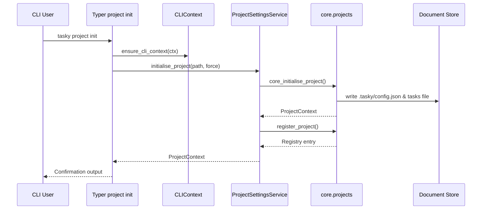

# CLI Architecture Overview

## Command Modules
- `tasky_cli/commands/projects.py` handles project lifecycle commands (`tasky project init/register/list/prune/unregister/config`).
- `tasky_cli/commands/tasks.py` handles task operations (`tasky task list/add/remove/complete/reopen/update/import`).
- Each module exports a `register(app)` function so the root CLI only wires sub-apps together.

### Project Config
- `tasky project config` prints the current `.tasky/config.json` or applies updates via `--set key=value`. Only supported keys (currently `tasks_file`) are accepted, and the command prompts before migrating storage backends unless `--force` is supplied.
- Changes flow through `ProjectSettingsService.update_project_config`, which migrates the dataset, overwrites targets when forced, and touches the registry entry so progress queries remain accurate.

### Project Progress Cache
- Registry entries cache `total_tasks/completed_tasks`, so `tasky project list` can show progress without walking every tasks repository. The cache refreshes automatically after any task mutation via a progress-aware `TaskService`.
- Users can force a recomputation via `tasky project list --refresh-progress`, which re-scans available projects and updates the registry cache (handy after manual edits or migrations executed outside the CLI).

### Task Completion & Updates
- `tasky task complete <id>` and `tasky task reopen <id>` flip the `completed` flag without editing JSON manually. Both commands run the new `task.pre_complete/task.post_complete` (and reopen) hooks so automations can react to state changes.
- `tasky task update <id> [--name ...] [--details ...]` lets users edit task content inline. At least one field is required; hooks can mutate the payload via `task.pre_update` before the core applies validation.
- All new commands share the same structured error handling as add/remove/import, so hook failures surface with exit code `3`, validation issues emit exit code `2`, and repository errors bubble up as exit code `1`.

### Task Imports
- `tasky task import` supports `--strategy append|replace|merge` (default `append`). Strategies are implemented in `tasky_core.importers` and executed via `TaskUseCases.import_tasks`, so adding new strategies only requires core extensions—not CLI rewrites.

### Task Exports
- `tasky task export [--file path] [--completed|--pending]` serialises tasks using the same JSON schema as imports (list of task payloads). Without `--file`, the payload prints to STDOUT so it can be piped directly into other tools.
- Passing `--file` writes to disk; the command refuses to overwrite existing files unless `--force` is supplied. Use `--completed` or `--pending` to filter the dataset without mutating storage.

## Dependency Container
- `tasky_cli.deps` hosts a lightweight container with `get_task_service`, `configure_dependencies`, and `reset_dependencies`.
- Commands never instantiate services directly; they request them from the container, which now maintains a single `ProjectSettingsService` instance that feeds the task service, project query service, and any direct `context.settings()` calls. Overriding `configure_dependencies(settings_service_factory=...)` automatically rewires every consumer to the new instance.
- Tests can inject fakes by calling `configure_dependencies(task_service_factory=...)` and later `reset_dependencies()` to restore defaults.

## CLI Context
- `tasky_cli.context` builds a `CLIContext` (console + settings + service factories) and stores it on `typer.Context.obj`.
- Command handlers accept `CLIContext` as their first argument. The `command_action` decorator injects the context automatically, so handlers never touch `typer.Context` directly.
- Context-aware handlers remain easy to reuse in tests, since you can create a `CLIContext` manually (or a fake) and call the function directly.
- All file-system operations (initialising projects, pruning registries, unregistering metadata, etc.) go through `context.settings()` so dependency overrides and hook wiring remain consistent across commands and tests.

## Command Decorators
- Shared Typer behaviour lives in `tasky_cli.commands.common`.
- `command_action` wraps handlers with project-initialisation checks, consistent error-to-exit-code mapping, and a middleware pipeline (register via `register_command_middleware`).
- Middleware callbacks receive the `CLIContext`, command name, and a `next` callable so logging/telemetry can be added without touching every handler.
- Structured observability hooks are available via `register_command_observer`: each observer receives `CommandEvent` objects (phase, duration, exit code, errors) so metrics/log sinks can be wired in centrally.
- The CLI registers `structured_logging_middleware` by default, which prints key/value log lines at start/finish/exit; replace or clear it in tests via `clear_command_middlewares`.
- This keeps individual commands small, declarative, and focused purely on their domain action.

## UI Helpers
- Presentation logic (Rich tables, tree formatting, timestamp formatting) lives under `tasky_cli/ui/`.
- `tasky_cli/ui/formatting.py` centralises timestamp/status/id helpers so both task and project commands reuse consistent labels.

## Core Services
- CLI modules depend on `tasky_core.services.TaskService` (via the DI container) for business logic and `tasky_settings` for path/config resolution.
- Storage wiring goes through factories in `tasky_settings.ProjectSettingsService`, ensuring adapters remain swappable without touching the CLI.

## Sequence Diagram – `tasky project init`

