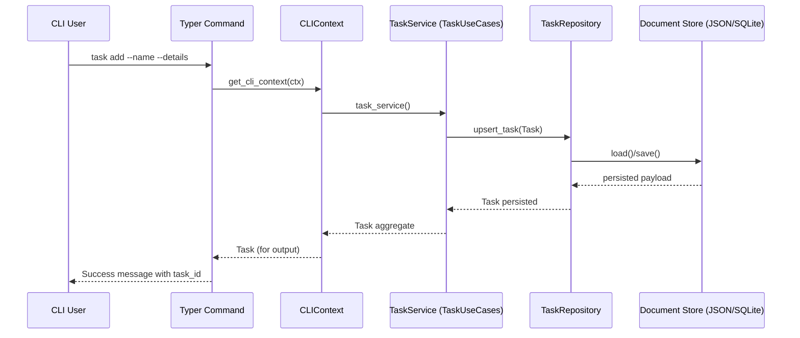

# Core Architecture

## Use-Case Layer
- `TaskUseCases` encapsulates orchestration for listing, creating, removing, and replacing tasks.
- Dependencies are injected:
  - `TaskRepository` (protocol) handles persistence.
  - `TaskFactory` builds validated aggregates, letting tests supply deterministic clocks.
  - `TaskTreeBuilder` wraps recursive traversal so alternate representations (e.g., cached trees) can be plugged in.
- `TaskService` is a façade that wires these collaborators together and exposes a narrow API to CLI/adapters.

## Domain Invariants
- `tasky-models.Task` now owns sanitization and timestamp rules via helpers like `Task.create`, `update_content`, and intrinsic validators.
- `TaskFactory` simply delegates to `Task.create`, translating any validation errors into `TaskValidationError` so orchestration code stays lean.
- Aggregate mutations (`add_subtask`, `remove_subtask`, completion toggles) call `touch()`, so neither the task tree nor use-cases set timestamps manually anymore.

## Task Tree Utilities
- `TaskTree` centralises traversal, parent lookups, and mutation of nested tasks.
- `flatten_tasks` and `count_tasks` live alongside the tree to keep hierarchical logic co-located with the structure it operates on.
- Tests can construct `TaskTree` (or inject builders) to validate complex behaviours without touching disk.

## Extending the Core
- Add new use-cases by composing repository calls inside `TaskUseCases` or by deriving specialised services that wrap it.
- Introduce alternative factories or tree builders (e.g., enforcing naming rules, caching) by injecting them where needed—callers remain oblivious.
- Keep orchestration pure; any IO (storage, settings) should go through injected protocols so `tasky-core` stays infrastructure-agnostic.

## Sequence Diagram – `tasky task add`

