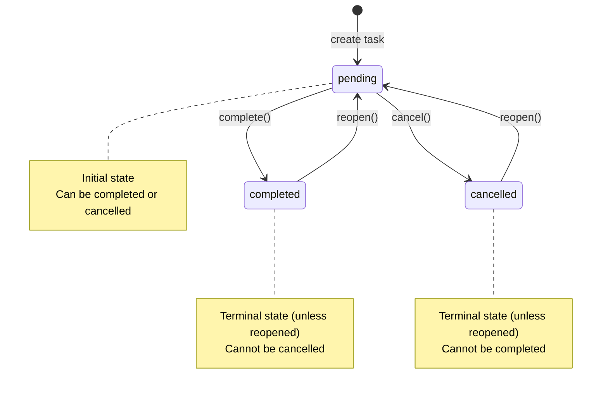

# Design: Task State Transition Validation

**Change ID**: `add-task-state-transitions`  
**Date**: 2025-11-11

## Overview

This design implements a finite state machine (FSM) for task status transitions, ensuring data integrity and workflow consistency. The state machine is embedded within the domain model (`TaskModel`) with orchestration handled by the service layer (`TaskService`) and user-facing commands in the CLI.

## Architecture Decisions

### 1. State Machine Location: Domain Model

**Decision**: Implement state transition validation directly in `TaskModel`

**Rationale**:
- **Domain-Driven Design**: State transitions are core business rules belonging to the domain model
- **Encapsulation**: Task knows its own valid states and transition rules
- **Testability**: State machine logic can be tested independently of infrastructure
- **Consistency**: All code paths use the same validation, preventing bypass

**Alternatives Considered**:
- Service-level validation: Would allow inconsistent state changes if model is modified directly
- Repository validation: Mixes infrastructure concerns with business rules
- External state machine library: Overkill for simple state logic, adds dependency

### 2. Transition Definition: Dictionary-Based

**Decision**: Use `TASK_TRANSITIONS: dict[TaskStatus, set[TaskStatus]]` constant

**Rationale**:
- **Simplicity**: Clear, readable mapping of allowed transitions
- **Performance**: O(1) lookup for validation
- **Extensibility**: Easy to add new statuses and rules
- **Documentation**: Self-documenting structure

**Example**:
```python
TASK_TRANSITIONS: dict[TaskStatus, set[TaskStatus]] = {
    TaskStatus.PENDING: {TaskStatus.COMPLETED, TaskStatus.CANCELLED},
    TaskStatus.COMPLETED: {TaskStatus.PENDING},  # reopen
    TaskStatus.CANCELLED: {TaskStatus.PENDING},  # reopen
}
```

**Alternatives Considered**:
- Transition classes/objects: More complex, not needed for simple rules
- Allow-list in each status enum: Spreads logic across multiple places
- Hard-coded if/elif chains: Harder to maintain and extend

### 3. Transition Methods: Explicit Intent

**Decision**: Provide both generic `transition_to()` and convenience methods (`complete()`, `cancel()`, `reopen()`)

**Rationale**:
- **Generic**: `transition_to(status)` handles validation for any transition
- **Convenience**: `complete()`, `cancel()`, `reopen()` express business intent clearly
- **DRY**: Convenience methods delegate to `transition_to()` to avoid duplication
- **Flexibility**: Internal code can use generic method, external callers use convenient ones

**Method Signatures**:
```python
def transition_to(self, target_status: TaskStatus) -> None:
    """Transition to target status with validation."""
    
def complete(self) -> None:
    """Mark task as completed."""
    
def cancel(self) -> None:
    """Mark task as cancelled."""
    
def reopen(self) -> None:
    """Reopen a completed or cancelled task."""
```

### 4. Exception Handling: Domain-Specific

**Decision**: Raise `InvalidStateTransitionError` with context for invalid transitions

**Rationale**:
- **Type Safety**: Allows callers to distinguish transition errors from other exceptions
- **Context**: Exception includes current status, target status for debugging
- **User Feedback**: CLI can format specific, actionable error messages
- **Dependency**: Requires `add-domain-exception-hierarchy` change

**Exception Context**:
```python
raise InvalidStateTransitionError(
    task_id=self.task_id,
    current_status=self.status,
    target_status=target_status,
    message=f"Cannot transition from {self.status.value} to {target_status.value}"
)
```

### 5. Timestamp Integration: Automatic Updates

**Decision**: Call `self.mark_updated()` within `transition_to()` after successful validation

**Rationale**:
- **Consistency**: All state transitions update timestamp automatically
- **Encapsulation**: Timestamp logic stays in domain model
- **Dependency**: Requires `add-automatic-timestamps` change
- **Visibility**: Clear in code that transitions trigger updates

**Order of Operations**:
1. Validate transition is allowed
2. Update status: `self.status = target_status`
3. Update timestamp: `self.mark_updated()`

### 6. Service Layer: Orchestration Only

**Decision**: Service methods (`complete_task()`, etc.) orchestrate fetch → transition → save

**Rationale**:
- **Single Responsibility**: Service handles persistence, model handles validation
- **Error Handling**: Service raises `TaskNotFoundError`, model raises `InvalidStateTransitionError`
- **Transaction Boundary**: Service defines operation boundary for future transactions
- **Testing**: Can test service with mock repository, model with plain objects

**Service Method Pattern**:
```python
def complete_task(self, task_id: UUID) -> TaskModel:
    """Mark a task as completed."""
    task = self.get_task(task_id)
    if task is None:
        raise TaskNotFoundError(task_id=task_id)
    task.complete()  # Calls transition_to(), validates, updates timestamp
    self.repository.save_task(task)
    return task
```

### 7. CLI Commands: User-Friendly Verbs

**Decision**: Add explicit commands (`complete`, `cancel`, `reopen`) rather than generic `set-status`

**Rationale**:
- **Usability**: Matches user mental model of task lifecycle
- **Discoverability**: Commands appear in help, clear what they do
- **Error Messages**: Can provide transition-specific guidance
- **Future-Proof**: Easy to add command-specific options (e.g., `--note` for completion)

**Command Signatures**:
```bash
tasky task complete <task-id>
tasky task cancel <task-id>
tasky task reopen <task-id>
```

## State Diagram



## Data Flow

### Completing a Task

```
CLI: tasky task complete abc-123
  ↓
CLI.complete_command(task_id="abc-123")
  ↓ parse UUID
TaskService.complete_task(uuid)
  ↓ fetch
TaskRepository.get_task(uuid) → TaskModel
  ↓ business logic
TaskModel.complete()
  ↓ delegate
TaskModel.transition_to(COMPLETED)
  ↓ validate
TASK_TRANSITIONS[PENDING] contains COMPLETED? ✓
  ↓ update
TaskModel.status = COMPLETED
TaskModel.mark_updated()  # updates updated_at
  ↓ persist
TaskRepository.save_task(task)
  ↓ success
CLI: "✓ Task 'Do the thing' completed at 2025-11-11 10:30:00 UTC"
```

### Invalid Transition

```
CLI: tasky task cancel abc-123  (task already completed)
  ↓
TaskService.cancel_task(uuid)
  ↓ fetch
TaskRepository.get_task(uuid) → TaskModel (status=COMPLETED)
  ↓
TaskModel.cancel()
  ↓
TaskModel.transition_to(CANCELLED)
  ↓ validate
TASK_TRANSITIONS[COMPLETED] contains CANCELLED? ✗
  ↓ error
raise InvalidStateTransitionError(
    current_status=COMPLETED,
    target_status=CANCELLED
)
  ↓ catch in CLI
CLI: "✗ Cannot cancel completed task. Use 'tasky task reopen' to make it pending again."
```

## Error Handling Strategy

### Domain Layer (TaskModel)
- Raises `InvalidStateTransitionError` for invalid transitions
- Includes current status, target status, task_id in exception
- Does not handle exceptions (pure business logic)

### Service Layer (TaskService)
- Raises `TaskNotFoundError` if task doesn't exist
- Propagates `InvalidStateTransitionError` from model
- Does not catch exceptions (orchestration only)

### CLI Layer (Commands)
- Catches `TaskNotFoundError` → "Task not found: {task_id}"
- Catches `InvalidStateTransitionError` → "Cannot {action} {current_status} task. {suggestion}"
- Catches `ValueError` (UUID parsing) → "Invalid task ID format"
- Maps exceptions to exit codes: 0=success, 1=domain error, 3=storage error

**Error Message Examples**:
```
✗ Task not found: abc-123

✗ Cannot cancel completed task. Use 'tasky task reopen abc-123' to make it pending again.

✗ Cannot complete cancelled task. Use 'tasky task reopen abc-123' first.

✗ Invalid task ID format. Expected UUID (e.g., 123e4567-e89b-12d3-a456-426614174000)
```

## Testing Strategy

### Unit Tests: TaskModel State Machine
- **Valid Transitions**: Test each allowed transition succeeds
- **Invalid Transitions**: Test each forbidden transition raises exception
- **Convenience Methods**: Test `complete()`, `cancel()`, `reopen()` delegate correctly
- **Timestamp Updates**: Verify `updated_at` changes on transition
- **Exception Context**: Verify exception contains current/target status

### Unit Tests: TaskService
- **Success Cases**: Test transition methods return updated task
- **Not Found**: Test methods raise `TaskNotFoundError` for missing tasks
- **Invalid Transition**: Test methods propagate `InvalidStateTransitionError`
- **Repository Interaction**: Mock repository, verify `get_task()` and `save_task()` called

### Integration Tests: CLI Commands
- **Success Flow**: Test command → service → repository → success message
- **Error Cases**: Test TaskNotFoundError and InvalidStateTransitionError handling
- **Exit Codes**: Verify correct exit codes for success and errors
- **Output Format**: Verify user-facing messages are clear and actionable

### Test Data Matrix

| Current Status | complete() | cancel() | reopen() |
|---------------|------------|----------|----------|
| PENDING       | ✓ → COMPLETED | ✓ → CANCELLED | ✗ InvalidStateTransitionError |
| COMPLETED     | ✗ InvalidStateTransitionError | ✗ InvalidStateTransitionError | ✓ → PENDING |
| CANCELLED     | ✗ InvalidStateTransitionError | ✗ InvalidStateTransitionError | ✓ → PENDING |

## Migration Strategy

**No migration required**. This is purely additive:

1. **Existing tasks**: All valid statuses remain valid
2. **Existing code**: Current code can continue setting status directly during creation
3. **New code**: Use transition methods for status changes after creation
4. **Backward compatibility**: No breaking changes to `TaskModel`, `TaskService`, or CLI

## Performance Considerations

- **Validation cost**: O(1) dictionary lookup, negligible overhead
- **No additional I/O**: State validation happens in memory
- **Same persistence cost**: Still one `save_task()` call per transition
- **Memory**: `TASK_TRANSITIONS` dict is small constant (~100 bytes)

## Security Considerations

- **No new attack surface**: State transitions don't involve user input parsing
- **Validation bypass**: Direct status assignment still possible in tests, but not exposed via CLI
- **Audit trail**: Future consideration, not in this change (would use hooks)

## Future Extensions

### Add New Status (e.g., "in-progress")
```python
class TaskStatus(str, Enum):
    PENDING = "pending"
    IN_PROGRESS = "in_progress"  # New
    COMPLETED = "completed"
    CANCELLED = "cancelled"

TASK_TRANSITIONS = {
    TaskStatus.PENDING: {TaskStatus.IN_PROGRESS, TaskStatus.CANCELLED},
    TaskStatus.IN_PROGRESS: {TaskStatus.COMPLETED, TaskStatus.CANCELLED},  # New
    TaskStatus.COMPLETED: {TaskStatus.PENDING},
    TaskStatus.CANCELLED: {TaskStatus.PENDING},
}
```

### Add Transition Guards (e.g., completion requires subtasks done)
```python
def transition_to(self, target_status: TaskStatus) -> None:
    if not self._can_transition_to(target_status):
        raise InvalidStateTransitionError(...)
    
    # Call guard hooks
    if not self._validate_transition_guards(target_status):
        raise TransitionGuardError(...)
    
    self.status = target_status
    self.mark_updated()
```

### Add Transition Actions (e.g., notify on completion)
```python
def transition_to(self, target_status: TaskStatus) -> None:
    # ... validation ...
    
    old_status = self.status
    self.status = target_status
    self.mark_updated()
    
    # Emit event for hooks
    self._emit_transition_event(old_status, target_status)
```

## Open Questions

None. Design is straightforward and follows established patterns in the codebase.

## References

- VISION.md: User Story 4 - Task State Transition Validation
- Finite State Machine Pattern: https://en.wikipedia.org/wiki/Finite-state_machine
- Domain-Driven Design: Evans, Chapter 5 - Entities
- Repository Pattern: Fowler, Patterns of Enterprise Application Architecture
