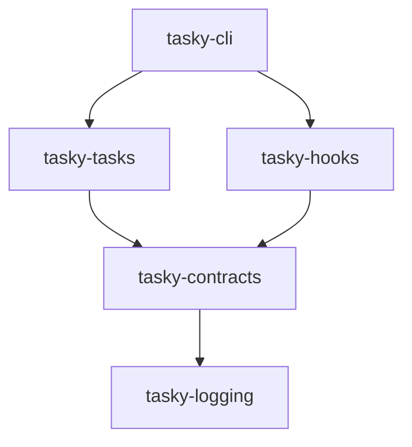

# Design: Shared Contracts Package

## Architecture
We will introduce a new package `tasky-contracts` at the bottom of the dependency graph (above `tasky-logging` but below domain packages).

### Dependency Graph

## Components to Extract
1.  **TaskSnapshot**: The immutable representation of a task state.
2.  **TaskStatus**: The enum defining task states (currently in `tasky-tasks`).
3.  **Common Exceptions**: Any shared exception types if applicable.

## Migration Strategy
1.  Create `packages/tasky-contracts`.
2.  Move `TaskStatus` from `tasky-tasks` to `tasky-contracts`.
3.  Define `TaskSnapshot` in `tasky-contracts`.
4.  Update `tasky-tasks` to use `TaskStatus` from contracts and implement conversion to `TaskSnapshot`.
5.  Update `tasky-hooks` to use `TaskSnapshot` from contracts.
6.  Update all consumers (CLI, storage, etc.) to import from new locations.
